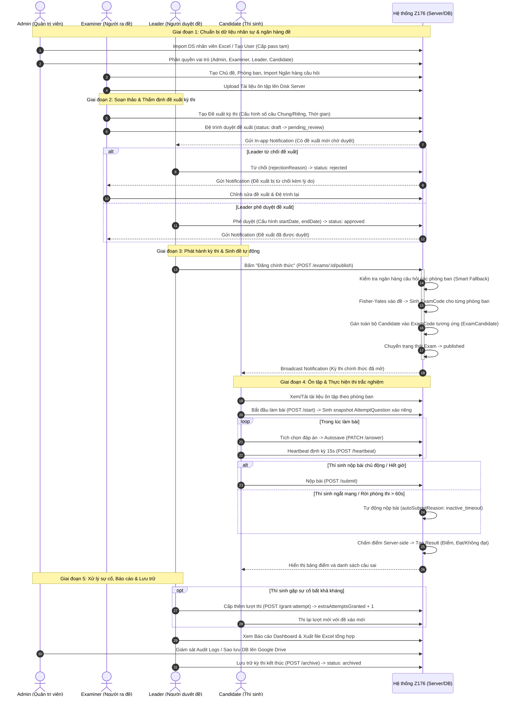

# ĐẶC TẢ CHI TIẾT LUỒNG HOẠT ĐỘNG 4 VAI TRÒ (ROLES)
## HỆ THỐNG THI TRẮC NGHIỆM CHUYÊN MÔN NỘI BỘ Z176

> **Đơn vị áp dụng:** Công ty TNHH MTV 76 (Nhà máy Z176) - Bộ Quốc phòng  
> **Tài liệu tham chiếu chuẩn xác:** Phản ánh 100% logic mã nguồn Backend (Node.js/Express/MongoDB) & Frontend (React/Vite).

---

## MỤC LỤC TỔNG QUAN

1. [Bảng ma trận phân quyền 4 Roles](#1-bảng-ma-trận-phân-quyền-4-roles)
2. [Đặc tả Role 1: Quản trị viên (Admin - `admin`)](#2-role-1-quản-trị-viên-admin---admin)
3. [Đặc tả Role 2: Người ra đề (Examiner - `examiner`)](#3-role-2-người-ra-đề-examiner---examiner)
4. [Đặc tả Role 3: Người duyệt đề (Leader - `leader`)](#4-role-3-người-duyệt-đề-leader---leader)
5. [Đặc tả Role 4: Thí sinh (Candidate - `candidate`)](#5-role-4-thí-sinh-candidate---candidate)
6. [Sơ đồ phối hợp liên vai trò (Inter-role Workflow)](#6-sơ-đồ-phối-hợp-liên-vai-trò-inter-role-workflow)
7. [Bảng mã lỗi và xử lý ngoại lệ theo từng Role](#7-bảng-mã-lỗi-và-xử-lý-ngoại-lệ-theo-từng-role)

---

## 1. BẢNG MA TRẬN PHÂN QUYỀN 4 ROLES

| Nhóm chức năng / Nghiệp vụ | Admin (`admin`) | Examiner (`examiner`) | Leader (`leader`) | Candidate (`candidate`) |
| :--- | :---: | :---: | :---: | :---: |
| **Quản lý người dùng & phân quyền** (CRUD, Import Excel, Reset pass) | **Toàn quyền** | ❌ Không có quyền | ❌ Không có quyền | ❌ Không có quyền |
| **Xuất danh sách tài khoản & mật khẩu tạm** (`/export-credentials`) | **Toàn quyền** | ❌ Không có quyền | ❌ Không có quyền | ❌ Không có quyền |
| **Sao lưu & Phục hồi dữ liệu** (Drive Backup/Restore) | **Toàn quyền** | ❌ Không có quyền | ❌ Không có quyền | ❌ Không có quyền |
| **Xem Nhật ký hệ thống (Audit Logs)** | **Toàn quyền** | ❌ Không có quyền | ❌ Không có quyền | ❌ Không có quyền |
| **Quản lý Chủ đề thi & Phòng ban** (CRUD Topic / Department) | **Toàn quyền** | **Toàn quyền** | ❌ Không có quyền | ❌ Không có quyền |
| **Quản lý Ngân hàng câu hỏi** (CRUD, Import Excel, Upload ảnh) | **Toàn quyền** | **Toàn quyền** | ❌ Không có quyền | ❌ Không có quyền |
| **Quản lý Tài liệu ôn tập** (Upload, Xóa tài liệu PDF/Word) | **Toàn quyền** | **Toàn quyền** | Chỉ xem/tải | Chỉ xem/tải theo PB |
| **Soạn thảo & Đệ trình Đề xuất kỳ thi** (`draft` -> `pending_review`) | ❌ Xem danh sách | **Toàn quyền tạo/gửi** | ❌ Chỉ thẩm định | ❌ Không có quyền |
| **Thẩm định, Phê duyệt / Từ chối Đề xuất kỳ thi** | ❌ Không có quyền | ❌ Không có quyền | **Toàn quyền** | ❌ Không có quyền |
| **Phát hành kỳ thi & Kích hoạt sinh đề tự động** (`publish`) | ❌ Không có quyền | ❌ Không có quyền | **Toàn quyền** | ❌ Không có quyền |
| **Lưu trữ kỳ thi đã kết thúc** (`archive`) | ❌ Không có quyền | ❌ Không có quyền | **Toàn quyền** | ❌ Không có quyền |
| **Xem Báo cáo thống kê toàn diện & Xuất Excel** | **Toàn quyền** | ❌ Không có quyền | **Toàn quyền** | ❌ Không có quyền |
| **Cấp thêm lượt thi chính thức cho thí sinh** (`grant-attempt`) | ❌ Không có quyền | ❌ Không có quyền | **Toàn quyền** | ❌ Không có quyền |
| **Xem tài liệu ôn tập được cấp quyền theo phòng ban** | ✅ | ✅ | ✅ | **Toàn quyền** |
| **Tham gia làm bài thi trắc nghiệm (Autosave, Heartbeat)** | ❌ Không làm bài | ❌ Không làm bài | ❌ Không làm bài | **Toàn quyền** |
| **Xem Lịch sử kết quả thi cá nhân** | ❌ | ❌ | ❌ | **Toàn quyền** |
| **Nhận chuông thông báo In-app** | Chỉ thông báo lỗi gán đề | Nhận duyệt/từ chối/lỗi | Nhận đề xuất thi | Nhận kỳ thi phát hành |

---

## 2. ROLE 1: QUẢN TRỊ VIÊN (ADMIN - `admin`)

Vai trò Quản trị viên chịu trách nhiệm cao nhất về hạ tầng người dùng, tính an toàn thông tin, sao lưu dữ liệu và giám sát an ninh toàn hệ thống.

```
                    ┌────────────────────────────────────────────────────────┐
                    │                    ROLE: ADMIN                         │
                    └───────────────────────────┬────────────────────────────┘
                                                │
       ┌────────────────────────┬───────────────┴───────────────┬─────────────────────────┐
       ▼                        ▼                               ▼                         ▼
┌──────────────┐      ┌──────────────────┐            ┌───────────────────┐     ┌───────────────────┐
│ Quản trị     │      │ Sao lưu &        │            │ Giám sát          │     │ Quản trị danh mục │
│ Tài khoản    │      │ Phục hồi DB      │            │ Nhật ký (Audit)   │     │ & Ngân hàng đề    │
└──────┬───────┘      └────────┬─────────┘            └─────────┬─────────┘     └─────────┬─────────┘
       │                       │                                │                         │
       ├─ CRUD / Khóa User     ├─ Backup Drive (Cron/Thủ công) ├─ Lọc theo Actor/Action  ├─ Topic / Dept
       ├─ Import Excel 2 bước  ├─ Tải file .gz                  ├─ Xem Metadata chi tiết  ├─ Ngân hàng câu hỏi
       ├─ Xuất DS pass tạm     └─ Khôi phục (mongorestore)      └─ Truy vết IP/Thời gian  └─ Tài liệu ôn tập
       └─ Đổi vai trò (Role)
```

### 2.1. Quản lý Người dùng & Phân quyền (Account Management)
*   **Danh sách tài khoản**: Xem danh sách toàn bộ cán bộ công nhân viên kèm trạng thái hoạt động (`isActive`), vai trò (`roleCode`), phòng ban, thông tin cá nhân. Hỗ trợ lọc theo phòng ban, vai trò, trạng thái khóa, tìm kiếm theo tên/mã nhân viên.
*   **Tạo mới tài khoản đơn lẻ**: Nhập thông tin nhân viên (`fullname`, `employeeCode`, `dob`, `gender`, `phone`, `position`, `departmentId`, `roleId`). Hệ thống tự động tạo `User` và `Employee`, đặt cờ `mustChangePassword = true`.
    *   *Đặc biệt*: Nếu đang có kỳ thi ở trạng thái `published`, hệ thống tự động gán nhân viên mới vào kỳ thi thông qua `assignEmployeeToActiveExamIfAny`.
*   **Import danh sách nhân viên từ tệp Excel (Quy trình 2 bước an toàn)**:
    1.  *Bước 1 (Preview - `POST /api/users/import/preview`)*: Tải file Excel danh sách nhân sự lên. Backend phân tích, kiểm tra tính hợp lệ dữ liệu, đối soát với CSDL và phân loại từng dòng (hợp lệ mới, trùng mã nhân viên đang hoạt động, trùng tài khoản bị khóa trước đó, lỗi định dạng). Trả kết quả xem trước trực quan cho Admin, **hoàn toàn chưa ghi dữ liệu vào DB**.
    2.  *Bước 2 (Confirm - `POST /api/users/import/confirm`)*: Admin kiểm tra bảng preview, xác nhận nhập thật. Hệ thống thực hiện ghi DB hàng loạt, tự động kích hoạt gán vào kỳ thi đang `published` nếu có.
*   **Xuất thông tin tài khoản & Reset mật khẩu hàng loạt (`POST /api/users/export-credentials`)**:
    *   Hành động có side-effect quan trọng: Reset mật khẩu của toàn bộ tài khoản `candidate` đang hoạt động thành mật khẩu ngẫu nhiên an toàn, đồng thời xuất ra tệp Excel gồm `Họ tên`, `Mã NV`, `Username`, `Mật khẩu mới` để bàn giao cho các đơn vị phòng ban.
*   **Khóa / Mở khóa tài khoản (`PATCH /api/users/:id/lock`)**:
    *   Khóa tài khoản nhân viên khi nghỉ việc hoặc vi phạm kỷ luật. Tài khoản bị khóa sẽ ngay lập tức bị thu hồi phiên làm việc (`tokenVersion++`) và cập nhật `lockedAt = new Date()`.
    *   Mở khóa tài khoản: Reset `lockedAt = null`, `failedLoginAttempts = 0`, `lockUntil = null`.
*   **Thay đổi vai trò (`PATCH /api/users/:id/role`)**: Nâng cấp hoặc chuyển đổi vai trò của người dùng (giữa Admin, Examiner, Leader, Candidate).
*   **Reset mật khẩu đơn lẻ (`POST /api/users/:id/reset-password`)**: Sinh mật khẩu ngẫu nhiên mới cho 1 tài khoản cụ thể và đặt `mustChangePassword = true`.

### 2.2. Quản lý Sao lưu & Phục hồi Dữ liệu (Backup & Restore)
*   **Sao lưu tự động**: Cron job chạy định kỳ **03:00 sáng hàng ngày** (múi giờ `Asia/Ho_Chi_Minh`), tự động xuất bản sao lưu `mongodump`, nén định dạng `.gz`, tải lên Google Drive (OAuth2) và tự động xoay vòng giữ tối đa **5 bản sao lưu mới nhất** (xóa bản cũ hơn).
*   **Sao lưu thủ công (`POST /api/backups`)**: Admin có thể bấm nút "Tạo bản sao lưu ngay" bất kỳ lúc nào để sao lưu tức thời trước khi thực hiện các thay đổi lớn.
*   **Xem danh sách bản sao lưu (`GET /api/backups`)**: Hiển thị danh sách các file sao lưu trên Google Drive gồm tên file, kích thước, thời gian tạo.
*   **Tải về bản sao lưu (`GET /api/backups/:fileId/download`)**: Stream trực tiếp file nén `.gz` từ Google Drive về máy tính của Admin.
*   **Khôi phục dữ liệu (`POST /api/backups/restore`)**:
    *   Admin tải lên tệp `.gz` (tối đa 2GB) và bắt buộc nhập chuỗi xác nhận `confirm = "RESTORE"`.
    *   Hệ thống thực hiện `mongorestore --drop` (xóa dữ liệu hiện tại và nạp lại toàn bộ dữ liệu từ bản sao lưu). Ghi audit log an ninh nghiêm ngặt `BACKUP_RESTORE`.

### 2.3. Giám sát Nhật ký An ninh Hệ thống (Audit Logs)
*   **Truy cập Nhật ký (`GET /api/audit-logs`)**: Admin có quyền tra cứu toàn bộ vết hoạt động trong hệ thống.
*   **Bộ lọc chi tiết**: Lọc theo người thực hiện (`actorUserId`), loại tài nguyên (`resourceType`), hành động (`action`: tạo/sửa/xóa/đăng nhập/khóa...), khoảng thời gian.
*   **Thông tin chi tiết**: Mỗi bản ghi lưu trữ địa chỉ IP client, thời gian thực hiện, metadata trước và sau khi thay đổi (diff) và trạng thái thành công/thất bại.

### 2.4. Báo cáo & Quản lý Danh mục dùng chung
*   Admin có toàn quyền truy cập xem các báo cáo tổng quan (`/reports/overview`, `/reports/by-department`, `/reports/by-exam`, `/reports/results`), xuất báo cáo Excel tương tự Leader.
*   Admin có quyền cấu hình thêm/sửa/xóa Chủ đề (`Topic`), Phòng ban (`Department`), Ngân hàng câu hỏi (`Question`) và Tài liệu ôn tập (`StudyDocument`).

---

## 3. ROLE 2: NGƯỜI RA ĐỀ (EXAMINER - `examiner`)

Người ra đề chịu trách nhiệm xây dựng nội dung chuyên môn: quản trị danh mục chủ đề, phòng ban, biên soạn và import ngân hàng câu hỏi, upload tài liệu ôn tập và lập đề xuất kỳ thi đệ trình lên Leader.

```
                    ┌────────────────────────────────────────────────────────┐
                    │                   ROLE: EXAMINER                       │
                    └───────────────────────────┬────────────────────────────┘
                                                │
       ┌────────────────────────┬───────────────┴───────────────┬─────────────────────────┐
       ▼                        ▼                               ▼                         ▼
┌──────────────┐      ┌──────────────────┐            ┌───────────────────┐     ┌───────────────────┐
│ Quản lý      │      │ Ngân hàng        │            │ Tài liệu          │     │ Soạn thảo Đề xuất │
│ Chủ đề & PB  │      │ Câu hỏi          │            │ Ôn tập            │     │ Kỳ thi            │
└──────┬───────┘      └────────┬─────────┘            └─────────┬─────────┘     └─────────┬─────────┘
       │                       │                                │                         │
       ├─ Thêm/Sửa/Xóa Topic   ├─ Nhập câu hỏi lẻ (Lý thuyết/TH)├─ Upload file PDF/Word   ├─ Tạo đề xuất Draft
       └─ Thêm/Sửa/Xóa Dept    ├─ Import Excel (Preview/Confirm)├─ Gán Scope (Chung/PB)   ├─ Cấu hình tỷ lệ câu
                               ├─ Upload ảnh câu hỏi Cloudinary └─ Xóa tài liệu           ├─ Đệ trình (Submit)
                               └─ Xóa nhiều câu hỏi (Bulk)                                └─ Nhận Notification
```

### 3.1. Quản lý Chủ đề thi & Phòng ban (Topics & Departments)
*   **Quản lý Chủ đề (`/api/topics`)**: Tạo mới, chỉnh sửa tên/mô tả, kích hoạt/hủy kích hoạt chủ đề kiểm tra chuyên môn (ví dụ: *An toàn lao động*, *Kỹ thuật dệt may*, *Nghiệp vụ cơ khí*). Cho phép bấm xem nhanh ngân hàng câu hỏi thuộc chủ đề đó.
*   **Quản lý Phòng ban (`/api/departments`)**: Quản lý danh mục các phòng ban/phân xưởng trong nhà máy kèm mã phòng ban (`code`) và chuẩn hóa định danh (`slug`).

### 3.2. Quản lý Ngân hàng Câu hỏi (Question Bank)
*   **Phân loại đa chiều**:
    *   Gắn theo **Chủ đề** (`topicId`).
    *   **Phạm vi áp dụng (`scope`)**:
        *   `Common`: Dùng chung cho toàn bộ cán bộ công nhân viên toàn nhà máy.
        *   `DepartmentSpecific`: Câu hỏi đặc thù chuyên môn của riêng 1 phòng ban (bắt buộc chọn `departmentId`).
    *   **Loại câu hỏi (`questionKind`)**: `theory` (Lý thuyết) hoặc `practice` (Thực hành).
    *   **Độ khó (`difficulty`)**: `easy` (Dễ), `medium` (Trung bình), `hard` (Khó).
    *   **Kiểu đáp án (`answerType`)**: `single` (Chọn 1 đáp án đúng) hoặc `multiple` (Chọn nhiều đáp án đúng).
*   **Tải ảnh minh họa câu hỏi (`POST /api/questions/upload-image`)**:
    *   Tải ảnh minh họa trực tiếp lên Cloudinary sử dụng bộ nhớ đệm `memoryStorage` (không ghi file tạm ra đĩa).
    *   Tạo `public_id` bằng chuỗi băm SHA-256 nội dung ảnh để chống trùng lặp. Tự động xóa ảnh cũ trên Cloudinary khi người dùng thay ảnh khác.
*   **Nhập câu hỏi thủ công**: Thêm/sửa từng câu hỏi, nội dung câu hỏi, danh sách 2-6 phương án trả lời, đánh dấu phương án đúng (`isCorrect`).
*   **Import câu hỏi từ Excel (Quy trình 2 bước)**:
    1.  *Preview (`POST /api/questions/import/preview`)*: Đọc file Excel biểu mẫu câu hỏi, kiểm tra cú pháp, validate dữ liệu, trả về danh sách các câu hợp lệ và danh sách câu lỗi chi tiết từng dòng.
    2.  *Confirm (`POST /api/questions/import/confirm`)*: Nhận mảng câu hỏi đã được preview xác nhận và lưu đồng loạt vào DB.
*   **Thao tác hàng loạt (Bulk Operations)**: Hỗ trợ tìm kiếm, lọc theo chủ đề/phòng ban/loại/độ khó, và xóa nhiều câu hỏi cùng lúc (`POST /api/questions/bulk-delete`).

### 3.3. Quản lý Tài liệu Ôn tập (Study Documents)
*   **Đặc điểm lưu trữ**: Tệp tài liệu (.pdf, .doc, .docx, .xls, .xlsx, dung lượng tối đa 20MB) được **lưu trữ trực tiếp trên đĩa cứng server nội bộ** (`uploadDir`), đảm bảo an toàn bí mật tài liệu nội bộ nhà máy, không đưa lên dịch vụ đám mây công cộng.
*   **Phân quyền tài liệu**: Gắn theo chủ đề và cấu hình phạm vi `scope`:
    *   `Common`: Mọi thí sinh đều thấy và tải được.
    *   `DepartmentSpecific`: Chỉ thí sinh thuộc đúng phòng ban được chọn mới xem và tải được.
*   **Upload & Quản lý (`POST /api/study-documents`, `DELETE /api/study-documents/:id`)**: Thêm tài liệu mới kèm mô tả, xóa tài liệu cũ không còn hiệu lực.

### 3.4. Soạn thảo & Đệ trình Đề xuất Kỳ thi (Exam Proposals)
*   **Tạo Đề xuất Kỳ thi (`POST /api/exams`)**: Examiner tạo bản nháp kỳ thi (`status = 'draft'`) với các thông số:
    *   `title`: Tên kỳ thi (ví dụ: *"Kiểm tra An toàn Lao động & PCCC Quý 3"*).
    *   `topicId`: Chủ đề kỳ thi.
    *   `durationMinutes`: Thời gian làm bài (phút, ví dụ 30 phút).
    *   `totalQuestions`: Tổng số câu hỏi trong đề (ví dụ 30 câu).
    *   `commonQuestionCount`: Số câu hỏi chung cho toàn bộ nhân viên.
    *   `departmentQuestionCount`: Số câu hỏi riêng theo phòng ban.
    *   *Ràng buộc Model*: `commonQuestionCount + departmentQuestionCount === totalQuestions`.
    *   `passThresholdPercent`: Ngưỡng điểm đạt (mặc định 70%).
*   **Đệ trình duyệt (`POST /api/exams/:id/submit`)**:
    *   Chuyển trạng thái từ `draft` (hoặc `rejected`) sang `pending_review`.
    *   Hệ thống tự động kích hoạt gửi In-app Notification tới **tất cả người dùng có role `leader` đang active**.
    *   Examiner không thể sửa đổi thông số khi đề xuất đang ở trạng thái `pending_review`.
*   **Nhận phản hồi duyệt**:
    *   Nếu Leader duyệt -> Nhận thông báo `exam_approved`.
    *   Nếu Leader từ chối -> Nhận thông báo `exam_rejected` kèm lý do từ chối cụ thể (`rejectionReason`), đề xuất quay về trạng thái `rejected` để Examiner chỉnh sửa và đệ trình lại.

---

## 4. ROLE 3: NGƯỜI DUYỆT ĐỀ (LEADER - `leader`)

Người duyệt đề là cán bộ quản lý chịu trách nhiệm thẩm định chất lượng đề xuất kỳ thi, quyết định thời gian tổ chức, trực tiếp phát hành (kích hoạt thuật toán sinh đề tự động), lưu trữ kỳ thi, theo dõi tiến độ thi và xử lý sự cố cấp lượt thi cho thí sinh.

```
                    ┌────────────────────────────────────────────────────────┐
                    │                    ROLE: LEADER                        │
                    └───────────────────────────┬────────────────────────────┘
                                                │
       ┌────────────────────────┬───────────────┴───────────────┬─────────────────────────┐
       ▼                        ▼                               ▼                         ▼
┌──────────────┐      ┌──────────────────┐            ┌───────────────────┐     ┌───────────────────┐
│ Thẩm định &  │      │ Phát hành &      │            │ Cấp thêm Lượt thi │     │ Báo cáo Thống kê  │
│ Phê duyệt    │      │ Kích hoạt sinh đề│            │ (Khắc phục sự cố) │     │ & Xuất Excel      │
└──────┬───────┘      └────────┬─────────┘            └─────────┬─────────┘     └─────────┬─────────┘
       │                       │                                │                         │
       ├─ Xem chi tiết đề xuất ├─ Kiểm tra ngân hàng đủ câu     ├─ Tra cứu thí sinh gặp   ├─ Thống kê Overview
       ├─ Phê duyệt (Set date) ├─ Trộn đề Fisher-Yates          │  sự cố mất mạng/treo máy├─ Thống kê Phòng ban
       ├─ Từ chối (Nêu lý do)  ├─ Tạo mã đề PB + gán Candidate  ├─ Grant attempt (+1 lượt)├─ Thống kê Bài thi
       └─ Lưu trữ (Archive)    └─ Gửi Broadcast Notification    └─ Thí sinh được thi lại  └─ Xuất Excel chi tiết
```

### 4.1. Thẩm định, Phê duyệt & Từ chối Kỳ thi (Exam Review Workflow)
*   **Danh sách chờ duyệt**: Xem toàn bộ các đề xuất kỳ thi ở trạng thái `pending_review` do các Examiner gửi lên.
*   **Xem chi tiết đề xuất**: Kiểm tra tổng số câu, tỷ lệ câu chung/riêng, thời lượng thi, ngưỡng điểm đạt và số lượng câu hỏi hiện có trong ngân hàng của từng phòng ban.
*   **Phê duyệt kỳ thi (`POST /api/exams/:id/approve`)**:
    *   Leader phê duyệt đề xuất và bắt buộc thiết lập cấu hình khung thời gian tổ chức: Thời điểm bắt đầu (`startDate`) và Thời điểm kết thúc (`endDate`).
    *   Trạng thái chuyển thành `approved`.
    *   Hệ thống tự động gửi thông báo `exam_approved` tới Examiner đã tạo đề xuất.
*   **Từ chối đề xuất (`POST /api/exams/:id/reject`)**:
    *   Leader bắt buộc nhập lý do từ chối (`rejectionReason`).
    *   Trạng thái chuyển thành `rejected` (trả về cho Examiner chỉnh sửa).
    *   Hệ thống gửi thông báo `exam_rejected` kèm lý do tới đúng Examiner tạo đề xuất.

### 4.2. Phát hành Kỳ thi & Tự động Sinh đề (`POST /api/exams/:id/publish`)
Khi Leader bấm nút **"Đăng chính thức (Phát hành)"**, hệ thống kích hoạt chuỗi xử lý tự động:
1.  **Kiểm tra tính sẵn sàng của câu hỏi (`validateQuestionAvailability`)**:
    *   Quét toàn bộ nhân viên đang hoạt động của tất cả phòng ban.
    *   Kiểm tra số lượng câu hỏi chung và câu hỏi riêng của từng phòng ban xem có đủ số lượng theo cấu hình kỳ thi hay không.
    *   *Cơ chế bù đắp thông minh (Smart Fallback)*: Nếu câu hỏi riêng của phòng ban bị thiếu, hệ thống tự động bù thêm từ kho câu hỏi chung. Nếu tổng số câu (Chung + Riêng) vẫn không đủ, hệ thống lập tức chặn lại và báo rõ phòng ban nào đang thiếu bao nhiêu câu.
2.  **Sinh mã đề thi phân tán (`ExamCode` & `ExamCodeQuestion`)**:
    *   Sử dụng thuật toán Fisher–Yates xáo ngẫu nhiên để trích xuất tập câu hỏi cho từng phòng ban.
    *   Tạo mã đề riêng cho từng phòng ban (ví dụ `D3F9A1-XUONG1`).
    *   Tạo chuỗi băm `fingerprint` (SHA-256) kiểm tra tính duy nhất.
3.  **Tự động phân bổ thí sinh (`ExamCandidate`)**:
    *   Gán toàn bộ nhân viên trực thuộc phòng ban vào mã đề tương ứng của phòng ban đó.
4.  **Cập nhật trạng thái & Gửi thông báo diện rộng**:
    *   Kỳ thi chuyển sang trạng thái `published` (`publishedAt = new Date()`).
    *   Gửi In-app Notification thông báo kỳ thi mới tới **toàn bộ người dùng đang active**, ngoại trừ tài khoản Admin và chính Leader bấm nút phát hành.

### 4.3. Lưu trữ Kỳ thi (`POST /api/exams/:id/archive`)
*   Khi kỳ thi kết thúc khung thời gian hoặc hoàn thành đợt thi, Leader bấm "Lưu trữ" (`archive`).
*   Trạng thái chuyển thành `archived`. Khóa toàn bộ các thao tác làm bài thi của kỳ thi này, chuyển dữ liệu vào chế độ chỉ đọc và lưu trữ lịch sử báo cáo.

### 4.4. Cấp thêm Lượt thi Chính thức (`POST /api/exam-attempts/candidates/:examCandidateId/grant-attempt`)
*   **Bối cảnh**: Thí sinh gặp sự cố bất khả kháng ngoài ý muốn (mất điện đột ngột, lỗi phần cứng thiết bị phòng máy, mạng diện rộng đứt khiến bài thi bị khóa/tự nộp).
*   **Thao tác của Leader**:
    *   Tại tab *Kết quả chi tiết*, Leader tìm thí sinh gặp sự cố, kiểm tra nhật ký làm bài và bấm nút **"Cấp thêm lượt thi"**.
    *   Hệ thống tăng trường `extraAttemptsGranted` thêm 1 trong bản ghi `ExamCandidate` của thí sinh.
    *   Số lượt thi tối đa thực tế của thí sinh được nâng lên: `MAX_OFFICIAL_ATTEMPTS (1) + extraAttemptsGranted`.
    *   Thí sinh có thể vào lại phòng thi để bắt đầu 1 lượt thi mới với snapshot đề thi xáo trộn mới hoàn toàn.
    *   Chức năng chỉ thực hiện được khi kỳ thi đang ở trạng thái `published`.

### 4.5. Báo cáo & Thống kê Toàn diện (Reports & Analytics)
Leader có quyền truy cập hệ thống báo cáo đa chiều trực quan:
*   **Tổng quan (`GET /api/reports/overview`)**: Tổng số thí sinh đã thi, tỷ lệ đạt/không đạt toàn công ty, điểm trung bình chung.
*   **Theo phòng ban (`GET /api/reports/by-department`)**: Biểu đồ so sánh tỷ lệ đạt và điểm trung bình giữa các phân xưởng, phòng ban nghiệp vụ.
*   **Theo bài thi (`GET /api/reports/by-exam`)**: Phân tích kết quả, phổ điểm của từng kỳ thi cụ thể.
*   **Kết quả chi tiết (`GET /api/reports/results`)**: Danh sách kết quả điểm số từng cá nhân thí sinh (họ tên, mã NV, phòng ban, số câu đúng/sai, điểm số, trạng thái đạt/không đạt, thời gian nộp bài). Hỗ trợ lọc theo phòng ban, trạng thái đạt/không đạt, khoảng thời gian.
*   **Xuất Báo cáo Excel chuyên nghiệp (`exceljs`)**:
    *   `GET /api/reports/export`: Tải file Excel danh sách kết quả tổng hợp chi tiết toàn bộ nhân viên.
    *   `GET /api/reports/export-by-exam`: Tải file Excel phân tích chuyên sâu theo từng bài thi.

---

## 5. ROLE 4: THÍ SINH (CANDIDATE - `candidate`)

Thí sinh là đối tượng trung tâm tham gia quá trình ôn tập và trực tiếp thực hiện bài thi trắc nghiệm trên hệ thống.

```
                    ┌────────────────────────────────────────────────────────┐
                    │                   ROLE: CANDIDATE                      │
                    └───────────────────────────┬────────────────────────────┘
                                                │
       ┌────────────────────────┬───────────────┴───────────────┬─────────────────────────┐
       ▼                        ▼                               ▼                         ▼
┌──────────────┐      ┌──────────────────┐            ┌───────────────────┐     ┌───────────────────┐
│ Học tập &    │      │ Vào Phòng thi &  │            │ Giám sát Realtime │     │ Chấm điểm & Xem   │
│ Ôn tập       │      │ Nhận Đề xáo riêng│            │ Chống Gian lận    │     │ Lịch sử Kết quả   │
└──────┬───────┘      └────────┬─────────┘            └─────────┬─────────┘     └─────────┬─────────┘
       │                       │                                │                         │
       ├─ Xem TL theo PB       ├─ getMyExam (Kiểm tra lượt)     ├─ Autosave từng câu (DB) ├─ Chấm điểm Server-side
       ├─ Xem trực tiếp PDF    ├─ startAttempt (Sinh snapshot   ├─ Heartbeat định kỳ 15s  ├─ Đạt/Không đạt (%pass)
       └─ Tải về máy tính      │  AttemptQuestion độc lập)      ├─ Cảnh báo rời tab 10s   ├─ Tra cứu lịch sử cá nhân
                               └─ Resume phiên đang dở          └─ Auto-submit nếu vắng>1p└─ Xem chi tiết câu sai
```

### 5.1. Ôn tập & Tra cứu Tài liệu Chuyên môn
*   **Phân quyền xem tài liệu (`GET /api/study-documents/candidate`)**:
    *   Thí sinh chỉ nhìn thấy danh mục tài liệu ôn tập phù hợp với mình: Gồm các tài liệu phạm vi Dùng chung (`Common`) và tài liệu Riêng đúng phòng ban của thí sinh (`DepartmentSpecific` có `departmentId === user.employee.departmentId`).
    *   Tách bạch 2 danh sách: Tài liệu trọng tâm theo kỳ thi đang mở (`activeDocs`) và Tất cả tài liệu nghiệp vụ đã ban hành (`allDocs`).
*   **Xem & Tải tài liệu (`GET /api/study-documents/:id/file`)**:
    *   Xem trực tiếp tài liệu PDF trên trình duyệt qua modal đọc tài liệu.
    *   Tải file tài liệu về máy tính cá nhân. Mọi luồng tải file đều qua xác thực JWT và kiểm tra quyền phòng ban tại server.

### 5.2. Luồng Làm bài thi Trắc nghiệm (Exam Execution Flow)
Quy trình làm bài thi của thí sinh được thiết kế nghiêm ngặt qua 7 bước:

```text
[Thí sinh vào phòng thi]
         │
         ▼ (1. GET /api/exam-attempts/my-exam)
[Kiểm tra kỳ thi & lượt thi] ──(Có lượt in_progress còn hạn)──► [Khôi phục lại phiên làm bài]
         │ (Chưa thi)
         ▼ (2. POST /api/exam-attempts/start)
[Sinh snapshot AttemptQuestion: Xáo câu hỏi & xáo đáp án Fisher-Yates]
         │
         ▼ (3. Mở giao diện làm bài thi toàn màn hình & Đồng hồ đếm ngược)
    ┌────┴─────────────────────────────────────────┐
    │                                              │
    ▼ (Mỗi lần chọn đáp án)                        ▼ (Định kỳ mỗi 15s)
[4. PATCH /answer (Autosave)]            [5. POST /heartbeat (Duy trì lastActiveAt)]
    │                                              │
    └──────────────────────┬───────────────────────┘
                           │
    ┌──────────────────────┴───────────────────────┐
    │                                              │
    ▼ (Rời tab / Thu nhỏ cửa sổ)                   ▼ (Ngắt mạng / Tắt máy > 60s)
[6A. Cảnh báo vi phạm đếm ngược 10s]     [6B. Server phát hiện timeout tự nộp bài]
    │ (Hết 10s không quay lại)                     │ (autoSubmitReason: inactive_timeout)
    └──────────────────────┬───────────────────────┘
                           │
                           ▼ (7. POST /api/exam-attempts/:id/submit)
                  [Chấm điểm tự động trên Server]
                           │
                           ▼
                  [Hiển thị Bảng điểm & Kết quả Đạt / Không đạt]
```

#### Chi tiết từng bước kỹ thuật:
1.  **Kiểm tra trạng thái (`GET /api/exam-attempts/my-exam`)**:
    *   Hệ thống xác định kỳ thi đang `published`, lấy mã đề thi của thí sinh.
    *   Tất cả các câu hỏi trả về phía client **đều bị loại bỏ trường `isCorrect`** để đảm bảo không lộ đáp án trong mã nguồn client.
    *   Nếu phát hiện thí sinh đang có lượt `in_progress` chưa hết hạn: Trả về trạng thái làm bài dở dang kèm danh sách các đáp án đã autosave (`savedAnswers`) để khôi phục giao diện.
    *   Nếu phát hiện lượt cũ bị ngắt kết nối quá 60 giây: Kích hoạt tự động nộp bài ngay tại thời điểm request.
2.  **Khởi tạo Lượt thi (`POST /api/exam-attempts/start`)**:
    *   Kiểm tra số lượt: `attemptsUsed < (MAX_OFFICIAL_ATTEMPTS + extraAttemptsGranted)`. Nếu vượt quá -> Chặn với lỗi `ATTEMPTS_EXHAUSTED`.
    *   Tạo bản ghi `ExamAttempt` mới (`status = 'in_progress'`, `startedAt = now`, `expiresAt = now + durationMinutes * 60000`).
    *   **Sinh snapshot xáo trộn độc lập (`AttemptQuestion`)**:
        *   Lấy danh sách câu hỏi trong mã đề của phòng ban.
        *   Sử dụng thuật toán Fisher–Yates xáo ngẫu nhiên thứ tự các câu hỏi.
        *   Với từng câu hỏi, tiếp tục xáo ngẫu nhiên thứ tự các phương án trả lời `Answer`.
        *   Lưu toàn bộ snapshot này vào bảng `AttemptQuestion`.
        *   *Tính chất*: Snapshot là cố định cho riêng lượt thi đó — khi thí sinh reload trang hoặc đổi máy, thứ tự câu hỏi và đáp án không bị đổi lại.
3.  **Lưu đáp án tức thì (Autosave - `PATCH /api/exam-attempts/:id/answer`)**:
    *   Mỗi khi thí sinh chọn/bỏ chọn một phương án, client gọi API lưu ngay lập tức vào bảng `CandidateAnswer`.
    *   Bảo vệ bài làm tuyệt đối trước các sự cố sập nguồn, mất điện, đóng trình duyệt đột ngột.
    *   Cập nhật mốc `lastActiveAt = new Date()`. Chưa tính điểm ở bước này.
4.  **Duy trì nhịp tim kết nối (Heartbeat - `POST /api/exam-attempts/:id/heartbeat`)**:
    *   Khi tab làm bài đang mở và hiển thị (`document.visibilityState === 'visible'`), client tự động gửi heartbeat định kỳ **15 giây/lần** lên server để cập nhật `lastActiveAt`.
5.  **Cơ chế 2 Tầng Chống gian lận & Bỏ thi**:
    *   *Tầng 1 (Client Warning - 10 giây)*: Khi thí sinh chuyển tab, mở cửa sổ khác hoặc blur trình duyệt, giao diện bật Modal cảnh báo đếm ngược 10 giây. Nếu không quay lại trong 10 giây, client tự động kích hoạt nộp bài.
    *   *Tầng 2 (Server Defense - 60 giây / `INACTIVITY_TIMEOUT_MS`)*: Nếu thí sinh tắt máy hoặc ngắt mạng quá 60 giây không có tín hiệu heartbeat/autosave, Server tự động đóng lượt thi, chuyển sang `submitted` với lý do `inactive_timeout` và chấm điểm dựa trên các câu đã autosave.
6.  **Nộp bài & Chấm điểm Server-side (`POST /api/exam-attempts/:id/submit`)**:
    *   Chấm điểm đối soát trực tiếp giữa `CandidateAnswer` và `Answer.isCorrect` trong DB.
    *   *Câu 1 đáp án (`single`)*: Chọn đúng duy nhất 1 phương án đúng -> Được điểm.
    *   *Câu nhiều đáp án (`multiple`)*: Phải chọn đúng và đủ tất cả các phương án đúng, không chọn thừa phương án sai -> Được điểm.
    *   Tính điểm thang 100: $\text{Điểm} = \text{round}\left(\frac{\text{Số câu đúng}}{\text{Tổng số câu}} \times 100\right)$.
    *   Đánh giá Đạt/Không đạt: $\text{Điểm} \ge \text{passThresholdPercent}$.
    *   Lưu kết quả vào `Result`, cập nhật `ExamAttempt` thành `submitted`. Đảm bảo tính Idempotent (không bị chấm điểm 2 lần nếu bấm đúp).

### 5.3. Xem Lịch sử Kết quả & Báo cáo Cá nhân
*   **Tra cứu lịch sử kết quả (`GET /api/reports/my-results`)**:
    *   Thí sinh xem lại toàn bộ lịch sử các lần thi của bản thân.
    *   Hiển thị điểm số, số câu đúng/sai, thời gian làm bài, trạng thái Đạt/Không đạt.
    *   Xem biểu đồ trực quan biến thiên điểm số qua các kỳ thi (`Recharts`).
    *   Xem chi tiết bài làm: Hiển thị lại các câu hỏi đã trả lời sai để rút kinh nghiệm chuyên môn.

---

## 6. SƠ ĐỒ PHỐI HỢP LIÊN VAI TRÒ (INTER-ROLE WORKFLOW)

Sơ đồ thể hiện luồng tương tác nghiệp vụ khép kín giữa 4 vai trò trong một chu kỳ thi:



---

## 7. BẢNG MÃ LỖI VÀ XỬ LÝ NGOẠI LỆ THEO TỪNG ROLE

| Vai trò | Mã lỗi / Tình huống ngoại lệ | Nguyên nhân kỹ thuật | Hành vi xử lý của hệ thống |
| :--- | :--- | :--- | :--- |
| **Chung** | `AUTH_ACCESS_REVOKED` | Tài khoản vừa đăng nhập trên thiết bị/trình duyệt khác (`tokenVersion` bị tăng). | Thu hồi phiên hiện tại, hiển thị `SessionRevokedModal` chặn thao tác và yêu cầu đăng nhập lại. |
| **Chung** | `PASSWORD_CHANGE_REQUIRED` | Tài khoản đang có cờ `mustChangePassword: true`. | Chặn toàn bộ route nghiệp vụ, tự động mở `ChangePasswordModal` bắt buộc đổi mật khẩu mới. |
| **Chung** | `ACCOUNT_LOCKED` | Đăng nhập sai mật khẩu quá 5 lần liên tiếp. | Tự động khóa tài khoản tạm thời trong 15 phút (`lockUntil = now + 15m`). |
| **Admin** | `IMPORT_VALIDATION_ERROR` | File Excel import nhân sự không đúng định dạng cột hoặc dữ liệu ngày sinh/mã NV lỗi. | Trả danh sách lỗi chi tiết từng dòng ở bước Preview, không ghi DB rác. |
| **Admin** | `BACKUP_RESTORE_INVALID_CONFIRM` | Khôi phục dữ liệu nhưng không gửi `confirm: "RESTORE"`. | Chặn request khôi phục để tránh thao tác xóa DB ngoài ý muốn. |
| **Examiner** | `EXAM_TOTAL_QUESTIONS_MISMATCH` | `commonQuestionCount + departmentQuestionCount !== totalQuestions`. | Model validation ném lỗi 400 ngay khi tạo/sửa đề xuất kỳ thi. |
| **Examiner** | `STUDY_DOC_SCOPE_INVALID` | Đặt tài liệu scope `DepartmentSpecific` nhưng không chỉ định `departmentId`. | Chặn lưu tài liệu, báo lỗi thiếu trường phòng ban bắt buộc. |
| **Leader** | `NOT_ENOUGH_QUESTIONS` | Ngân hàng câu hỏi của một số phòng ban không đủ số lượng câu hỏi dù đã áp dụng bù đắp. | Chặn phát hành kỳ thi, trả về danh sách chi tiết các phòng ban đang bị thiếu câu hỏi. |
| **Leader** | `NO_CANDIDATES_AVAILABLE` | Toàn hệ thống không có nhân viên nào đang ở trạng thái `isActive: true`. | Chặn phát hành và thông báo không có thí sinh khả dụng. |
| **Candidate**| `ATTEMPTS_EXHAUSTED` | Thí sinh đã sử dụng hết số lượt thi cho phép (`attemptsUsed >= MAX + extra`). | Chặn bắt đầu lượt mới, hiển thị màn hình thông báo đã hoàn thành bài thi. |
| **Candidate**| `CANDIDATE_NOT_ASSIGNED` | Thí sinh không có tên trong danh sách được gán mã đề của kỳ thi đang mở. | Hiển thị thông báo thí sinh không thuộc đối tượng tham gia kỳ thi này. |
| **Candidate**| `EXAM_ATTEMPT_TIMEOUT` | Thí sinh ngắt kết nối/rời phòng thi quá 60 giây không gửi heartbeat. | Tự động đóng bài thi, chuyển trạng thái `submitted` với lý do `inactive_timeout` và chấm điểm. |
