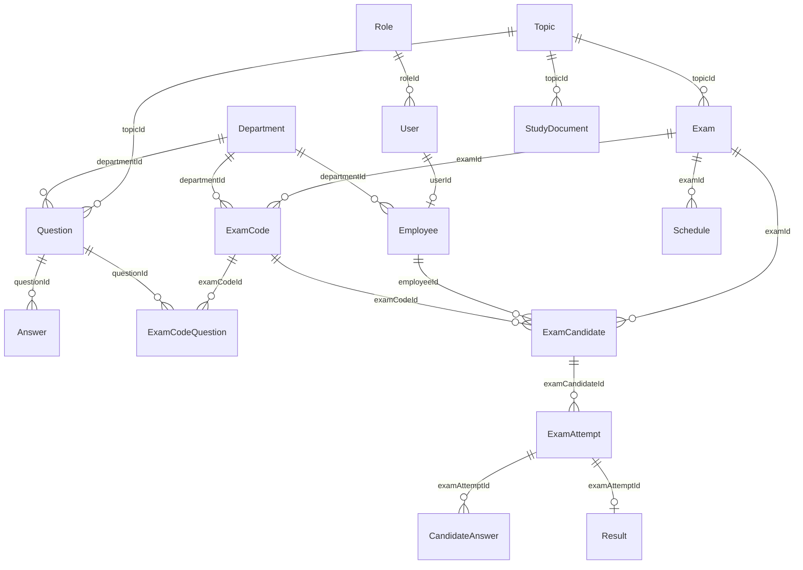

# Đề xuất schema Mongoose (bước 4 — chờ review trước API)

**Nguồn:** `UML/usecase.mdj` (ưu tiên tên field) + BRS Bước 9 + FR-001/002.  
**Code:** `server/src/models/*.model.js` (chưa có route/controller).  
**Skill tham chiếu:** `mongodb-schema-design` (LIBRARY.md mục 5) — **reference** qua `ExamCodeQuestion`, không embed `Question` trong `ExamCode`.

---

## Sơ đồ quan hệ (tóm tắt)

---

## Bảng collection

| Model (Mongoose) | Collection | StarUML / BRS | Ghi chú |
|---|---|---|---|
| `Role` | `roles` | `role` | `code` (admin/examiner/candidate/leader…) lưu DB |
| `User` | `users` | `user` | `passwordHash`, khóa đăng nhập sai |
| `Department` | `departments` | `department` | Bộ phận = “chức vụ” trên diagram |
| `Employee` | `employees` | `Employee` | `departmentId`, `userId` |
| `Topic` | `topics` | `topic` | Chủ đề lớn |
| `Question` | `questions` | `Question` | `scope`, `questionKind`, `answerType`, `difficulty` |
| `Answer` | `answers` | `Answer` | Tách collection, không embed |
| `Exam` | `exams` | `Exam` | `commonQuestionCount`, `departmentQuestionCount`, `durationMinutes` |
| `ExamCode` | `examcodes` | `ExamCode` | + `departmentId`, `questionSetFingerprint` |
| `ExamCodeQuestion` | `examcodequestions` | `ExamCodeQuestion` | + `orderIndex` |
| `ExamCandidate` | `examcandidates` | `ExamCandidate` | Unique `(examId, employeeId)` |
| `ExamAttempt` | `examattempts` | `ExamAttempt` | `attemptType` practice/official (FR-007) |
| `CandidateAnswer` | `candidateanswers` | `CandidateAnswer` | `selectedAnswerIds[]` |
| `Result` | `results` | `result` | GLOSSARY: ExamResult |
| `StudyDocument` | `studydocuments` | `Document` | Tên model tránh trùng DOM `Document`; MVP `filePath` local |
| `Schedule` | `schedules` | `schedule` | Should Have |
| `AuditLog` | `auditlogs` | *(thiếu diagram)* | Admin “quản lý log người tạo đề” |

---

## Khác biệt / assumption cần bạn chốt

| # | Nội dung | Đề xuất hiện tại | Cần xác nhận? |
|---|---|---|---|
| 1 | **Ngưỡng đạt** (FR-005) | `Exam.passThresholdPercent` default **70** — comment *Assumption nhóm nghiên cứu* | Có (BA) |
| 2 | **UML `Question.type`** | Tách `questionKind` (lý thuyết/bài tập) + `answerType` (single/multiple) | OK? |
| 3 | **`Exam.duration`** | Đổi tên `durationMinutes` (số, phút) | OK? |
| 4 | **`ExamCode.departmentId`** | Mỗi mã đề gắn 1 bộ phận cho phần câu riêng (FR-002) | Có — logic sinh đề |
| 5 | **GLOSSARY `ExamSession`** vs **`ExamAttempt`** | Code dùng **ExamAttempt** theo StarUML | Đồng bộ glossary sau? |
| 6 | **GLOSSARY `ExamConfig`** | Gom cấu hình trên **Exam** (theo prompt + diagram) | Đã thống nhất prompt |
| 7 | **Typo diagram** | `examAttemptld`, `submitttedAt` → `examAttemptId`, `submittedAt` | Sửa khi code |
| 8 | **Validate số câu chung/riêng** (BRS #4) | Pre-validate `common + department = totalQuestions` | Assumption: có validate; có thể nới rule sau BA |

---

## Enum (constants.js)

- `scope`: `Common` | `DepartmentSpecific` (BRS)
- `difficulty`: `easy` | `medium` | `hard`
- `exam.status`: `draft` → `pending_approval` → `approved` → `published` (FR-006, MVP sau)
- `attemptType`: `practice` | `official` (FR-007)

---

## Bước tiếp theo (sau khi bạn OK schema)

1. Auth + seed role/admin (env `ADMIN_SEED_*`) — bạn review middleware (AGENT_RULES mục 5).  
2. FR-001 Question bank + import Excel.  
3. FR-002 → FR-005 theo thứ tự Must Have.  
4. Client: giữ landing/modal hiện tại, chuyển dần sang `services/api.js` + token httpOnly.

---

*Tài liệu UML gốc:* [usecase.mdj](../UML/usecase.mdj) · *Design system (FE):* [design-system.md](../design/design-system.md)
