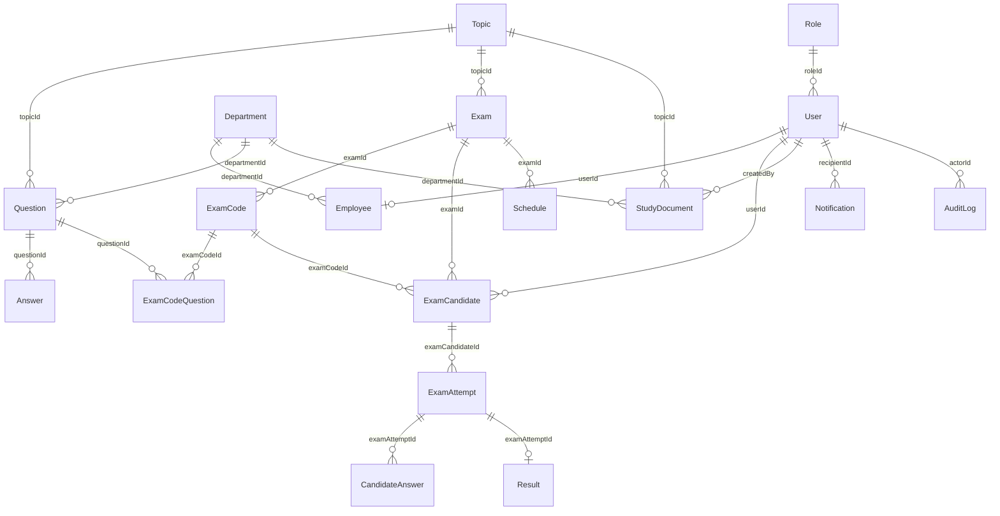

# Mô hình cơ sở dữ liệu (Mongoose Schema)

Hệ thống Z176 sử dụng MongoDB làm cơ sở dữ liệu chính. Mối quan hệ giữa các collection được quản lý chặt chẽ thông qua Mongoose ODM để phục vụ các nghiệp vụ sinh đề thi ngẫu nhiên và giám sát realtime.

---

## 1. Sơ đồ quan hệ thực thể (ERD)

---

## 2. Danh sách các Collections

| Tên Model | Bộ sưu tập (Collection) | Vai trò nghiệp vụ |
| :--- | :--- | :--- |
| `Role` | `roles` | Lưu trữ 4 quyền hạn nghiệp vụ cốt lõi: admin, examiner, leader, candidate. |
| `User` | `users` | Thông tin tài khoản đăng nhập (username, password hash, trạng thái khóa, tokenVersion đa thiết bị). |
| `Employee` | `employees` | Thông tin hồ sơ cá nhân nhân viên, liên kết 1-1 với `User` và thuộc 1 `Department`. |
| `Department` | `departments` | Danh mục phòng ban trong nhà máy (được dùng để phân bổ câu hỏi riêng và lọc báo cáo). |
| `Topic` | `topics` | Các chủ đề thi (ví dụ: An toàn lao động, Chuyên môn dệt, Chuyên môn may). |
| `Question` | `questions` | Ngân hàng câu hỏi trắc nghiệm, chứa các trường scope (chung/bộ phận), questionKind (lý thuyết/thực hành), answerType (single/multiple). |
| `Answer` | `answers` | Đáp án lựa chọn cho câu hỏi trắc nghiệm, chứa cờ `isCorrect`. Không embed để hỗ trợ import/export dễ dàng. |
| `Exam` | `exams` | Đề xuất kỳ thi và vòng đời phê duyệt (chờ duyệt, duyệt, phát hành, lưu trữ). Cấu hình số lượng câu hỏi chung/riêng, passThresholdPercent. |
| `ExamCode` | `examcodes` | Mã đề thi ngẫu nhiên (variant) được sinh tự động khi Leader nhấn phát hành kỳ thi. |
| `ExamCodeQuestion` | `examcodequestions` | Bảng liên kết trung gian lưu thứ tự câu hỏi đảo ngẫu nhiên của mỗi mã đề. |
| `ExamCandidate` | `examcandidates` | Danh sách thí sinh được chỉ định thi, liên kết với mã đề thi cụ thể, theo dõi số lượt thi tối đa và đã dùng. |
| `ExamAttempt` | `examattempts` | Lượt làm bài thực tế của thí sinh. Quản lý trạng thái realtime (`in_progress`, `submitted`, `expired`) và `lastActiveAt` để tự động nộp bài khi mất kết nối > 1 phút. |
| `CandidateAnswer` | `candidateanswers` | Bảng ghi nhận chi tiết các đáp án thí sinh đã lựa chọn cho mỗi câu hỏi khi nộp bài. |
| `Result` | `results` | Kết quả điểm số cuối cùng của lượt thi, lưu điểm (thang 100), số câu đúng và trạng thái Đạt/Không đạt. |
| `StudyDocument` | `studydocuments` | Tệp tin tài liệu ôn tập được Examiner upload (lưu trữ trên Cloudinary), gán theo phòng ban. |
| `Schedule` | `schedules` | Thiết lập thời gian mở đề và đóng đề của kỳ thi. |
| `Notification` | `notifications` | Hộp thư thông báo trong hệ thống hiển thị tin nhắn thông báo cho cán bộ và thí sinh. |
| `AuditLog` | `auditlogs` | Nhật ký lưu lại toàn bộ hành động chỉnh sửa cấu hình dữ liệu quan trọng của Admin và Examiner. |

---

## 3. Các quy tắc nghiệp vụ đặc thù trong cơ sở dữ liệu

*   **Pre-validate Số câu hỏi trong kỳ thi**: 
    Trước khi lưu kỳ thi (`Exam`), schema kiểm tra điều kiện ràng buộc: `commonQuestionCount` (số câu chung) + `departmentQuestionCount` (số câu riêng theo bộ phận) phải bằng chính xác `totalQuestions` (tổng số câu hỏi của đề thi).
*   **Ràng buộc Scope của câu hỏi**:
    *   Nếu câu hỏi có `scope: 'DepartmentSpecific'` (phạm vi riêng theo bộ phận), DB bắt buộc phải có `departmentId`.
    *   Nếu câu hỏi có `scope: 'Common'` (dùng chung), hệ thống tự động xóa trường `departmentId` (tránh lưu trữ dư thừa dữ liệu).
*   **Cơ chế lưu trữ File tài liệu ôn tập**:
    File tài liệu được lưu trữ dạng tệp tin nhị phân trên **Cloudinary** dưới dạng tài nguyên raw. Mongoose chỉ lưu trữ liên kết tĩnh an toàn kèm theo `imageCloudinaryId` (hoặc public_id trên Cloudinary) để phục vụ việc xóa hoặc thay thế tài nguyên sau này thông qua API.
*   **Trạng thái Lượt thi (`ExamAttempt`)**:
    *   `in_progress`: Th thí sinh đang làm bài, heartbeat được gửi đều đặn.
    *   `submitted`: Bài thi đã được thí sinh chủ động nhấn nộp thành công.
    *   `expired`: Bài thi bị hệ thống cưỡng chế nộp do quá giờ làm bài hoặc do thí sinh rời ca thi quá 1 phút (`autoSubmitReason: 'inactive_timeout'`).
